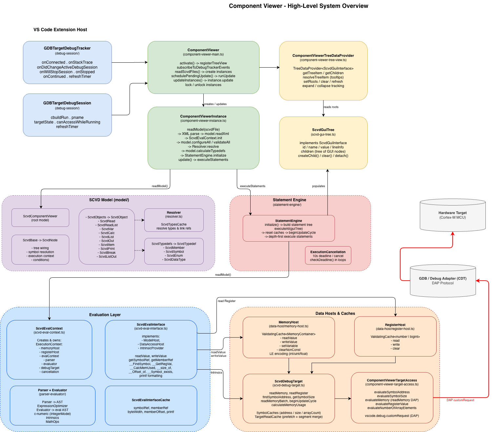

# Component Viewer — Architecture

The Component Viewer is a VS Code tree view that reads [SCVD](https://arm-software.github.io/CMSIS-View/main/elem_component_viewer.html) files from a CMSIS build and displays live target data during a debug session.

## Overview

At a high level, the Component Viewer consists of five layered subsystems:

```GDBTargetDebugTracker / GDBTargetDebugSession
        │  debug events & session state
        ▼
ComponentViewer  (component-viewer-main.ts)
  ├─ creates/manages ──▶  ComponentViewerInstance  (per SCVD file)
  │                         ├─ readModel()   XML → SCVD model  → StatementEngine
  │                         └─ update()      executeStatements → ScvdGuiTree
  └─ setRoots() ──────────▶  ComponentViewerTreeDataProvider
                               └─ reads ──▶  ScvdGuiTree  (ScvdGuiInterface)
```



### Subsystems

| Subsystem | Key files | Responsibility |
|-----------|-----------|----------------|
| **Controller** | `component-viewer-main.ts` | Orchestrates the lifecycle: activates the tree view, subscribes to debug events, creates instances, schedules debounced updates, manages lock/unlock. |
| **Instance** | `component-viewer-instance.ts` | Owns one SCVD file. Parses the XML into a model, initialises the evaluation context and statement engine, then re-executes statements on every update to populate a fresh `ScvdGuiTree`. |
| **Tree view** | `component-viewer-tree-view.ts` | VS Code `TreeDataProvider<ScvdGuiInterface>`. Receives roots from the controller (`setRoots`), tracks expand/collapse state, and provides items to VS Code for rendering. |
| **GUI tree** | `scvd-gui-tree.ts` | A flat-by-hierarchy tree of `ScvdGuiTree` nodes that implement `ScvdGuiInterface`. Each node carries an id, name, value, line info, and parent/children references. Populated by the Statement Engine during `update()`. |
| **SCVD model** | `model/` | Pure data model parsed from SCVD XML. Root is `ScvdComponentViewer`, containing `ScvdObjects`, `ScvdTypedefs`, etc. The `Resolver` links cross-references and builds the `ScvdTypesCache`. |
| **Statement Engine** | `statement-engine/` | Walks the model depth-first and executes each `Statement*` node (Read, Var, Calc, List, Out, Print, Break…). Each statement reads target data and writes `ScvdGuiTree` nodes. Protected by `ExecutionCancellation` (10 s deadline). |
| **Evaluation layer** | `scvd-eval-context.ts`, `scvd-eval-interface.ts`, `parser-evaluator/` | Evaluates SCVD expressions. `ScvdEvalContext` owns the execution context (memory host, register host, parser, evaluator, debug target). `ScvdEvalInterface` bridges the SCVD model to the evaluator and provides intrinsics (`__FindSymbol`, `__GetRegVal`, `printf`, …). |
| **Data hosts** | `data-host/`, `scvd-debug-target.ts`, `component-viewer-target-access.ts` | `MemoryHost` and `RegisterHost` are per-update caches on top of `ScvdDebugTarget`, which batches and prefetches reads via DAP (`vscode.debug.customRequest`). |

### Data flow — single update cycle

1. A debug event (stack trace, active session change, periodic timer) triggers `schedulePendingUpdate()`.
2. After a 150 ms debounce, `updateInstances()` calls `instance.update()` for each unlocked instance.
3. `update()` calls `StatementEngine.executeAll(guiTree)`, which resets the data-host caches, starts a batch read cycle, and executes all statements depth-first.
4. Each `StatementRead` / `StatementReadList` fetches memory or register values through `ScvdDebugTarget` → `ComponentViewerTargetAccess` → DAP.
5. When execution completes, the populated `ScvdGuiTree` roots are passed to `ComponentViewerTreeDataProvider.setRoots()`, which triggers a VS Code tree refresh.

## Diagrams

The remaining draw.io files cover individual subsystems in more detail.

| Diagram | Description |
|---------|-------------|
| [architecture.drawio](architecture.png) | High level overview. |
| [all-subsystems.drawio](all-subsystems.drawio) | Single-canvas overview of all subsystems and their connections. |
| [instance.drawio](instance.drawio) | Detail of `ComponentViewerInstance`: `readModel()` and `update()` call paths. |
| [scvd-model.drawio](scvd-model.drawio) | Class hierarchy of the SCVD model (`model/`). |
| [statement-engine.drawio](statement-engine.drawio) | Statement Engine internals and statement type hierarchy. |
| [evaluation-layer.drawio](evaluation-layer.drawio) | Evaluation layer: eval context, eval interface, parser/evaluator pipeline. |
| [data-host-caches.drawio](data-host-caches.drawio) | Data hosts and caching strategy (memory, registers, symbols). |
| [scvd-gui-tree.drawio](scvd-gui-tree.drawio) | `ScvdGuiTree` node structure and `ScvdGuiInterface` contract. |

*Note: Program is avaliable here: https://www.drawio.com/ or as VS Code extension.*
